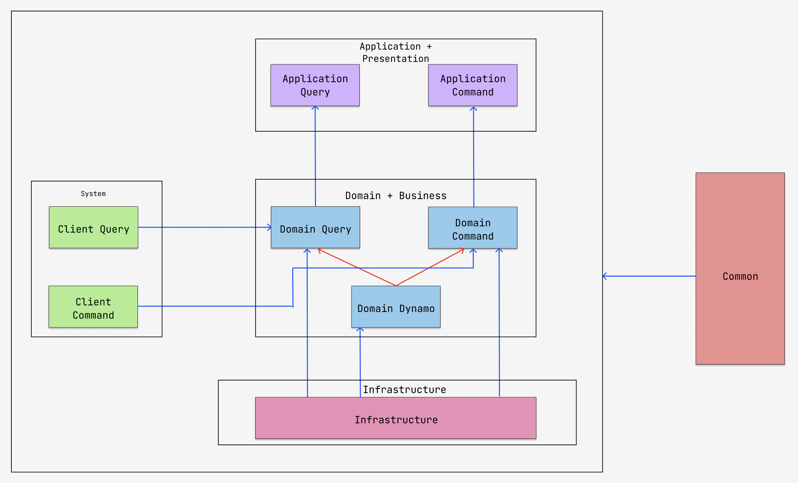

# Withmarket-main-server

이 프로젝트는 WithMarket의 **가게와 관련된 서비스**를 담당하는 스프링 기반의 프로젝트입니다.

현재는 **아키텍처의 확장** 에 집중하고 있으며, 요구사항이 모두 정해질 시 기능 구현을 할 에정입니다.

* * *

### 👉 본 프로젝트의 목적

본 프로젝트는 졸업작품을 위한 것 뿐만 아니라 본인의 실력 향상에도 목적을 두고있습니다.

따라서 본 프로젝트의 구현에 있어서 우선순위는 다음과 같습니다.

1️⃣ 확장에 유연한 아키텍처 설계 능력 향상

2️⃣ 역할과 책임이 명확하게 분리되어있는 설계

3️⃣ 신기술에 대해서 트레이드오프를 따지며 기술선정을 하는 능력

4️⃣ 기능 구현

* * *

### 👉 프로젝트 참여자 (Contributors of this project)
1️⃣ BrianDYKim (18k7102dy@naver.com) -> 레포지토리 주인장

* * *

### 👉 사용되는 기술 스택 (Tech used in this project)

1️⃣ **사용 언어**

2️⃣ **프로젝트 아키텍처**

* Multi-Module Architecture (멀티모듈 기반의 설계)
* CQRS Architecture (Command-Query Responsibility Segregation)

3️⃣ **개발 방법론**

* DDD (Domain Driven Development)

4️⃣ **사용된 데이터베이스**

 

5️⃣ **사용된 프레임워크**

  

6️⃣ **사용된 라이브러리**

  

7️⃣ **빌드 툴**

8️⃣ **Test Libraries**

 

9️⃣ **Container Tool**

* * *

### 👉 **모듈 분리에 관한 의사결정 과정**

저는 모듈의 분리에 관한 목적은 **코드의 역할과 책임에 따른 명확한 분리**에 있다고 생각합니다. 따라서 저는 **역할과 책임**을 분리하는 기준을 명확하게 할 필요가 있다고 보았습니다.

따라서 저는 3단계의 필터를 두어서 System에 관여하는 모듈을 4개 정도로 나누고자 하였습니다.

* * *

### 👉 **본 프로젝트 모듈 구조 (Module Structure of This Project)**

이 섹션에서는 본 프로젝트의 모듈에 대해서 설명하고자한다. 프로젝트 모듈을 분리하면서 주의해야할 점을 먼저 소개한 다음에, 본격적으로 본 프로젝트의 아키텍처를 설명하고자합니다.

1️⃣ 분리한 module 간에는 Bi-Directional Dependency (Dependency Cycle)이 발생하지 않도록 주의하자. 쌍방 의존이 안좋은것도 맞고, 그냥 gradle에서 빌드 자체가 안된다.

2️⃣ 분리한 module 간에는 Common 모듈이 아닌 이상 2단계 아래 참조는 웬만하면 금지한다. 2단게 아래 참조를 한다는건 모듈 분리가 잘못됐다는 증거다.

이제부터 본격적으로 프로젝트의 아키텍처에 대해서 설명하겠습니다.

1. **Application Layer**

응용계층, 표현 계층을 관리하는 모듈. 즉, Handler, Router class 들을 관리하는 모듈입니다.

* Application-query: 조회 로직을 관리하는 application module
* Application-command: 커맨드 로직을 관리하는 application module

2. **System Layer**

어플리케이션 로직을 모르고, 도메인 로직을 모르지만, System에는 관여하는 코드들을 모아둔 모듈입니다. 주로 DTO가 여기에 위치합니다.

* client-query: 조회 DTO를 모아둔 모듈
* client-command: 명령 로직에 사용되는 DTO를 모아둔 모듈

3. **Domain Layer**

Entity, Service, Repository, Validator를 구현하는 Layer.

* domain-dynamo: dynamo에 관련된 도메인을 관리하는 모듈. Entity, Repository, Validator를 보관하며, Repository에 대해서는 실제 구현체가 아닌 interface만을 보관합니다.
* domain-query: query 로직에 대한 Service를 구현하는 모듈
* domain-command: command 로직에 대한 Service를 구현하는 모듈

4. **Infrastructure**

domain layer에 존재하는 repository에 대해서 실제 구현체를 보관하는 모듈입니다. DB에 접근하기 위한 config, RepositoryImpl을 여기서 구현해서 Bean으로 등록합니다.

5. **Common**

System에는 관여하지 않지만, System을 구현함에 있어서 필요한 타입을 정의하는 모듈입니다.

**System에 관여하지 않는 타입클래스 혹은 툴만 여기다 위치시켜서 common hell에 빠지지 않도록 항상 주의합니다.**

* * *

### 👉 **본 프로젝트 전체적인 아키텍처(Architecture of This Project)**

우선 8월 10일 까지 구현한 아키텍처 기준으로 설명을 드리겠습니다.

* Application Query에서는 읽기 DB로 Redis를 사용합니다. Redis의 경우 In-memory Database이기 때문에 높은 throghput을 자랑하며, 초당 100만 요청까지 처리 가능한 것으로 알려져있습니다.
* Redis는 DynamoDB를 Look Aside 관계로 의존하는 형태이며, 찾고자하는 데이터가 Redis에 캐싱이 안 되어있거나, 혹은 DynamoDB와 싱크가 안 맞는 현상을 대비하기 위해 약한 결합을 띄고있습니다.
* Application Command의 경우 명령 요청을 처리하는 Application입니다. 명령 요청이 떨어지면 DynamoDB에 저장된 데이터에 변형이 발생하게됩니다. 예시를 한번 들어보면서 설명을 드리자면, 

1. ShopReview가 1번 가게에 작성이 되었다고 가정한다.
2. ShopReview의 경우 Application Command에서 잘 처리되어 dynamoDB의 shop-review table에 잘 저장된다.
3. 그러나, review가 작성이 되면 shop 테이블의 1번 가게의 리뷰 카운트 수를 늘려야한다. 
4. 동시에, redis에도 review가 캐시가 되어야한다.

* 3, 4번의 상황의 경우 Application Command 자체에서 처리하기에는 설계적 결함이 발생할 수 있습니다. ShopReview를 조작하는 코드에서 Shop까지 건드려서 저장한다? 당장에는 좋아도 만일 도메인별로 시스템을 찢게되면 나중에 이러한 커플링을 끊어야할지도 모릅니다.
* 저는 도메인 간의 디커플링을 최대한 이뤄내기 위해서 Apache Kafka를 도입하기로 결정했습니다. Application Command에서 명령 로직이 떨어지면 파생되는 이벤트를 발행해서 Kafka에 싣고, 이를 어디선가 consume하여 DynamoDB, Redis로 반영하면 되니까요.
* 이를 통해 shopReview를 건드리는 로직에서 Shop을 건드리지 않은 상태로 DynamoDB의 1번 가게 리뷰 카운트를 늘리고, 동시에 redis에도 캐싱을 할수있게 됩니다.

* * *

### 👉 발견한 에러 혹은 해결해야할 부분들

Spring Kafka에 Coroutine 적용시 에러가 걸리는 현상

Spring Kafka로 Coroutines를 이용해 message를 프로듀싱하는데는 문제가 없으나,이 메시지를 KafkaListener를 이용해서 consume할 때 문제가 발생합니다.

~~~
Cannot convert from [team.bakkas.domaindynamo.entity.ShopReview] to [kotlin.coroutines.Continuation] for GenericMessage 
[payload=ShopReview(reviewId=2d2b89fa-0e47-4643-bdff-92a9c0d99f1d, reviewTitle=꾸덕꾸덕한게 맛있네요!, shopId=85485be6-f065-4305-a8c6-ff23997ae9f1, shopName=Hash, reviewContent=아주아주 추천해요!, reviewScore=10.0, reviewPhotoList=[], createdAt=2022-08-11T20:27:36.023015, updatedAt=null), 
headers={kafka_offset=0, kafka_consumer=org.apache.kafka.clients.consumer.KafkaConsumer@43963b4d, kafka_timestampType=CREATE_TIME, kafka_receivedPartitionId=1, kafka_receivedTopic=withmarket.shopReview.create, kafka_receivedTimestamp=1660217256882, ...]
~~~

**위의 내용을 해석하자면, Message를 읽어서 Continuations를 생성할 때 문제가 발생한다는 것입니다.** 

코틀린 코루틴은 Continuations를 기반으로한 CPS 방식으로 동작하기 때문에, **Continuation이 생성되지 않는다는 것은 곧 Spring Kafka와 Coroutines를 함께 이용해서는 Event를 컨슘할 수 없다는 뜻입니다.** 😭

제가 해볼 시도는 다음과 같습니다

* (COMPLETE) Spring Kafka Listener에서는 **Kotlin Coroutines가 아닌 Mono를 이용해서 처리한다.**

👉 **해결 방법**
~~~kotlin
@KafkaListener(
    topics = [KafkaTopics.reviewCountEventTopic],
    groupId = KafkaConsumerGroups.updateShopReviewCountGroup
)
fun updateReviewCount(reviewCountEventDto: ShopCommand.ReviewCountEventDto) {
    /*
    1. Shop을 DynamoDB로부터 가져온다
    2. DynamoDB로부터 가져온 Shop에 대해서 averageScore, reviewCount를 조작한다.
    3. 해당 Shop을 DynamoDB에 갱신하고, 동시에 Redis에도 갱신한다.
     */
    val shopMono = with(reviewCountEventDto) {
        shopDynamoRepository.findShopByIdAndNameAsync(shopId, shopName)
    }.map { it!! }
        .map { changeShopInfo(it, reviewCountEventDto) }

    // 비동기적으로 dynamo, redis에 해당 정보 저장
    shopMono.flatMap { shopDynamoRepository.createShopAsync(it) }.subscribe()
    shopMono.flatMap { shopRedisRepository.cacheShop(it) }.subscribe()
}
~~~

